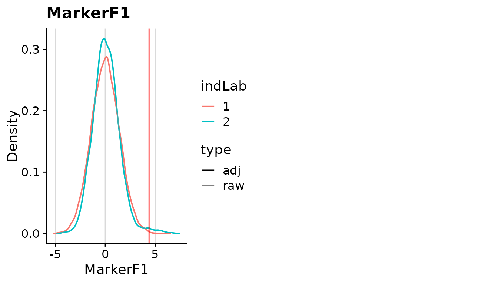

# Getting Started with stimgate

`stimgate` finds cells that may have responded to stimulation. For each
donor, it compares the stimulated samples with an unstimulated sample
from the same donor. This guide gates the example data, reads the
results and plots them.

## 1. Load the data

[`getExampleData()`](https://satvilab.github.io/stimgate/reference/getExampleData.md)
loads a small example dataset that comes with the package: two donors,
each with an unstimulated and a stimulated sample, and two markers. It
returns where the data are saved, the marker names, and `batchList`,
which groups each donor’s samples.

``` r

library(stimgate)
exampleData <- getExampleData()
gs <- flowWorkspace::load_gs(exampleData$pathGs)
exampleData$batchList
#> [[1]]
#> [1] 1 2
#> 
#> [[2]]
#> [1] 3 4
exampleData$marker
#> [1] "MarkerF1" "MarkerF2"
```

### Your own data

You can give
[`gateStim()`](https://satvilab.github.io/stimgate/reference/gateStim.md)
any of these:

- a GatingSet, flowSet, cytoset or flowFrame;
- FCS file paths, or a folder of FCS files;
- a list of numeric matrices or data frames, one per sample, with a
  column per channel;
- one data frame with a `sample` column saying which sample each cell is
  from.

Each element of `batchList` lists one donor’s samples, by number or by
name. **The first sample is the unstimulated one**; the rest are that
donor’s stimulated samples. Several donors can share one unstimulated
sample (it must be first in each), but a stimulated sample can belong to
only one donor.
[`getBatchList()`](https://satvilab.github.io/stimgate/reference/getBatchList.md)
can build `batchList` from a table describing your samples.

``` r

samples <- list(uns = unsMatrix, stim = stimMatrix) # columns named by channel
batchList <- list(donor1 = c("uns", "stim"))
```

StimGate does not transform your data (for example with arcsinh), so
give it values on the scale you want to gate. With matrices, the column
names are used as both channel and marker names. Only a GatingSet can
hold gated populations other than all cells (`"root"`). Use the same
data, in the same sample order, when you later call
[`plotStim()`](https://satvilab.github.io/stimgate/reference/plotStim.md)
or
[`writeStimFCS()`](https://satvilab.github.io/stimgate/reference/writeStimFCS.md).

## 2. Find the gates

Give
[`gateStim()`](https://satvilab.github.io/stimgate/reference/gateStim.md)
a folder for its results and the markers to gate. It saves everything in
that folder and returns the folder’s path. By default it uses all cells;
set `popGate` to gate within a population already in your GatingSet.

``` r

pathProject <- gateStim(
  pathProject = tempfile("stimgate_"),
  .data = gs,
  batchList = exampleData$batchList,
  marker = exampleData$marker
)
```

To pick channels by channel name instead, use `chnl` instead of
`marker`. The defaults suit most data; see
[`?stimControl`](https://satvilab.github.io/stimgate/reference/stimControl.md)
for the settings you can change, and
[`?gateStim`](https://satvilab.github.io/stimgate/reference/gateStim.md)
for setting them separately for each marker.

## 3. Read the gates and statistics

[`getStimGates()`](https://satvilab.github.io/stimgate/reference/getStimGates.md)
gives the gates for each stimulated sample (`ind`) and marker. `gate` is
the gate value. `gateCyt` is the gate used for cells already positive
for another cytokine; it can be lower than `gate`.

``` r

gates <- getStimGates(pathProject)
head(gates)
#> # A tibble: 4 × 8
#>   pop   gateName    chnl         marker   ind   batch   gate gateCyt
#>   <chr> <chr>       <chr>        <I<chr>> <chr> <chr>  <dbl>   <dbl>
#> 1 root  locminClust BC1(La139)Dd MarkerF1 2     batch1  4.40    4.40
#> 2 root  locminClust BC1(La139)Dd MarkerF1 4     batch2  3.87    3.87
#> 3 root  locminClust BC2(Pr141)Dd MarkerF2 2     batch1  3.40    2.17
#> 4 root  locminClust BC2(Pr141)Dd MarkerF2 4     batch2  2.90    2.90
```

[`getStimStats()`](https://satvilab.github.io/stimgate/reference/getStimStats.md)
gives, for each stimulated sample (`ind`), the number and percentage of
cells positive for each combination of markers (`cytCombn`), in the
stimulated sample and in its unstimulated sample. `freqBs` is the
stimulated percentage minus the unstimulated percentage: the response
after removing background.

``` r

stats <- getStimStats(pathProject)
head(stats[, c("ind", "cytCombn", "countStim", "freqStim", "freqUns", "freqBs")])
#> # A tibble: 6 × 6
#>   ind   cytCombn                       countStim freqStim freqUns freqBs
#>   <chr> <chr>                              <int>    <dbl>   <dbl>  <dbl>
#> 1 2     BC1(La139)Dd~+~BC2(Pr141)Dd~-~        51     0.51    0.06   0.45
#> 2 2     BC1(La139)Dd~-~BC2(Pr141)Dd~+~       425     4.25    1.54   2.71
#> 3 2     BC1(La139)Dd~+~BC2(Pr141)Dd~+~        47     0.47    0.02   0.45
#> 4 2     BC1(La139)Dd~-~BC2(Pr141)Dd~-~      9477    94.8    98.4   -3.61
#> 5 4     BC1(La139)Dd~+~BC2(Pr141)Dd~-~        94     0.94    0.25   0.69
#> 6 4     BC1(La139)Dd~-~BC2(Pr141)Dd~+~       516     5.16    1.19   3.97
```

## 4. Plot the results

Plot the first donor’s samples to compare unstimulated and stimulated
expression, with the gate drawn on. One marker gives density curves; two
markers also give two-dimensional plots, which need the `hexbin`
package.

``` r

plotStim(
  ind = exampleData$batchList[[1]], .data = gs,
  pathProject = pathProject, marker = exampleData$marker[1]
)
```



The results stay in `pathProject`, so you can read them again in a later
R session. To see more detail on how each gate was chosen, see
[`?getStimGatesDetailed`](https://satvilab.github.io/stimgate/reference/getStimGatesDetailed.md).
To save the positive cells as FCS files, see
[`?writeStimFCS`](https://satvilab.github.io/stimgate/reference/writeStimFCS.md).

## Session information

``` r

sessionInfo()
#> R version 4.6.1 (2026-06-24)
#> Platform: x86_64-pc-linux-gnu
#> Running under: Ubuntu 24.04.5 LTS
#> 
#> Matrix products: default
#> BLAS:   /usr/lib/x86_64-linux-gnu/openblas-pthread/libblas.so.3 
#> LAPACK: /usr/lib/x86_64-linux-gnu/openblas-pthread/libopenblasp-r0.3.26.so;  LAPACK version 3.12.0
#> 
#> locale:
#>  [1] LC_CTYPE=C.UTF-8       LC_NUMERIC=C           LC_TIME=C.UTF-8       
#>  [4] LC_COLLATE=C.UTF-8     LC_MONETARY=C.UTF-8    LC_MESSAGES=C.UTF-8   
#>  [7] LC_PAPER=C.UTF-8       LC_NAME=C              LC_ADDRESS=C          
#> [10] LC_TELEPHONE=C         LC_MEASUREMENT=C.UTF-8 LC_IDENTIFICATION=C   
#> 
#> time zone: UTC
#> tzcode source: system (glibc)
#> 
#> attached base packages:
#> [1] stats     graphics  grDevices utils     datasets  methods   base     
#> 
#> other attached packages:
#> [1] stimgate_0.99.16
#> 
#> loaded via a namespace (and not attached):
#>  [1] gtable_0.3.6         xfun_0.61            bslib_0.12.0        
#>  [4] ggplot2_4.0.3        htmlwidgets_1.6.4    ks_1.15.3           
#>  [7] Biobase_2.72.0       lattice_0.22-9       vctrs_0.7.3         
#> [10] tools_4.6.1          generics_0.1.4       stats4_4.6.1        
#> [13] tibble_3.3.1         flowWorkspace_4.24.0 pkgconfig_2.0.3     
#> [16] Matrix_1.7-5         KernSmooth_2.23-26   data.table_1.18.6.1 
#> [19] RColorBrewer_1.1-3   S7_0.2.2             desc_1.4.3          
#> [22] S4Vectors_0.50.3     graph_1.90.0         lifecycle_1.0.5     
#> [25] scam_1.2-22          compiler_4.6.1       farver_2.1.2        
#> [28] textshaping_1.0.5    htmltools_0.5.9      sass_0.4.10         
#> [31] yaml_2.3.12          flowCore_2.24.0      pracma_2.4.6        
#> [34] pillar_1.11.1        pkgdown_2.2.1        jquerylib_0.1.4     
#> [37] tidyr_1.3.2          cachem_1.1.0         mclust_6.1.3        
#> [40] nlme_3.1-169         RProtoBufLib_2.24.0  tidyselect_1.2.1    
#> [43] digest_0.6.39        mvtnorm_1.4-2        dplyr_1.2.1         
#> [46] purrr_1.2.2          labeling_0.4.3       splines_4.6.1       
#> [49] cowplot_1.2.0        fastmap_1.2.0        grid_4.6.1          
#> [52] cli_3.6.6            magrittr_2.0.5       ncdfFlow_2.58.0     
#> [55] XML_3.99-0.25        utf8_1.2.6           withr_3.0.3         
#> [58] scales_1.4.0         rmarkdown_2.32       matrixStats_1.5.0   
#> [61] otel_0.2.0           cytolib_2.24.0       ragg_1.5.2          
#> [64] evaluate_1.0.5       knitr_1.52           mgcv_1.9-4          
#> [67] rlang_1.3.0          glue_1.8.1           Rgraphviz_2.56.0    
#> [70] BiocManager_1.30.27  BiocGenerics_0.58.1  jsonlite_2.0.0      
#> [73] R6_2.6.1             systemfonts_1.3.2    fs_2.1.0
```
